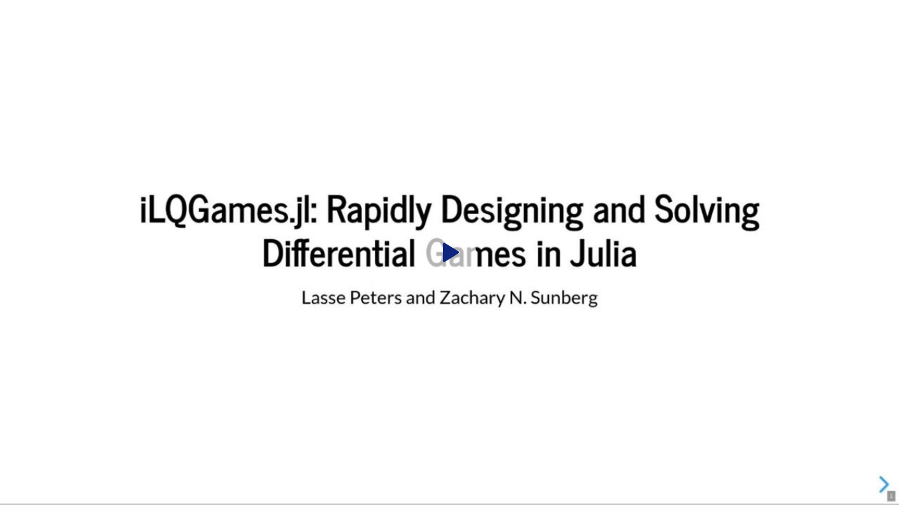
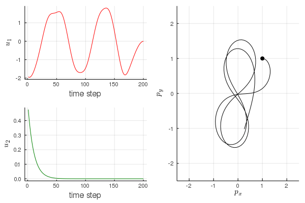

# iLQGames.jl

[](https://github.com/lassepe/iLQGames.jl/actions/workflows/ci.yml)
[](https://codecov.io/gh/lassepe/iLQGames.jl)
 [](https://opensource.org/licenses/BSD-3-Clause)

iLQGames.jl is a framework for rapidly designing and solving nonlinear general-sum differential
games, built around [iterative linear-quadratic game approximations](https://arxiv.org/abs/1909.04694).

A brief introduction to this framework and benchmarks against a [C++
implementation](https://github.com/HJReachability/ilqgames)
can be found in this [short workshop manuscript](https://arxiv.org/abs/2002.10185).
Finally, [this paper](https://arxiv.org/abs/2002.04354) demonstrates the flexibility and performance of iLQGames.jl
by combining it with a particle-filter scheme to reason about uncertainty in
differential games in real-time.

[](https://www.dropbox.com/s/y65qxltloz6fh3q/EMAS-WorkshopTalk.webm?dl=0)

## Installation

Within the Julia REPL run:

```julia
using Pkg
Pkg.add(PackageSpec(url="https://github.com/lassepe/iLQGames.jl"))
```

## Example

Here is an example of two players controlling a *single* 4D-unicycle.
Player-1 controls the steering, Player-2 controls the acceleration.


#### 1. Describe Dynamics

We define a Unicycle as a subtype of our `ControlSystem` type and implement the
differential equation by overloading `dx` for our type.


```julia
using iLQGames
import iLQGames: dx

# parameters: number of states, number of inputs, sampling time, horizon
nx, nu, ΔT, game_horizon = 4, 2, 0.1, 200

# setup the dynamics
struct Unicycle <: ControlSystem{ΔT,nx,nu} end
# the differential equation of a uncycle with state: (px, py, phi, v)
dx(cs::Unicycle, x, u, t) = SVector(x[4]cos(x[3]), x[4]sin(x[3]), u[1], u[2])
dynamics = Unicycle()

```

#### 2. Setup Costs

To setup the costs encoding each players objectives, we can derive a custom subtype
from `PlayerCost`, or, as done here, simply hand the cost function as a lambda function
to the `FunctionPlayerCost`.

```julia

# player-1 wants the unicycle to stay close to the origin,
# player-2 wants to keep close to 1 m/s
costs = (FunctionPlayerCost((g, x, u, t) -> (x[1]^2 + x[2]^2 + u[1]^2)),
         FunctionPlayerCost((g, x, u, t) -> ((x[4] - 1)^2 + u[2]^2)))
# indices of inputs that each player controls
player_inputs = (SVector(1), SVector(2))
```

#### 3. Solve the Game
With this information we can construct the game...

```julia
g = GeneralGame(game_horizon, player_inputs, dynamics, costs)
```

...and solve it for some initial conditions `x0`.
Automatic differentiation will save us from having to specify how to compute LQ approximations of the system.

```julia
# get a solver, choose initial conditions and solve (in about 9 ms with automatic differentiation)
solver = iLQSolver(g)
x0 = SVector(1, 1, 0, 0.5)
converged, trajectory, strategies = solve(g, solver, x0)
```

Finally, we can visualize the path of the unicycle as follows (x- and y-position):
```julia
# for visualization we need to state which state indices correspond to px and py
position_indices = tuple(SVector(1,2))
# Note: you can use the `plot_traj` call without @animated to get a non-animated plot instead.
@animated(plot_traj(trajectory, g, [:red, :green], player_inputs),
          1:game_horizon, "minimal_example.gif")
```

At the equilibrium solution, Player-2 accelerates to reach the desired speed. Player-1 steers the unicycle in
a figure-8 to stay close to the origin.:



